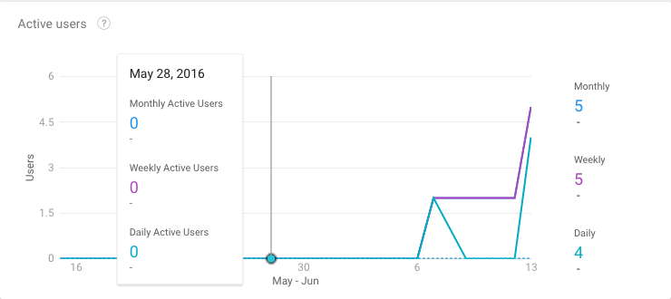
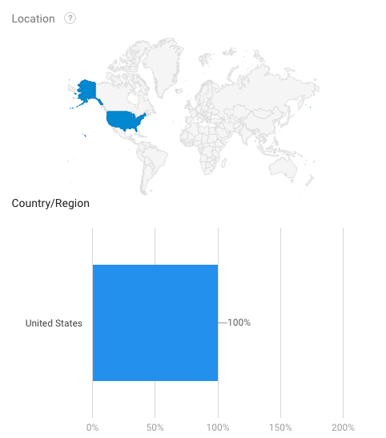
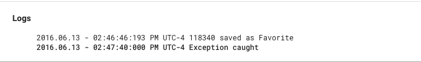
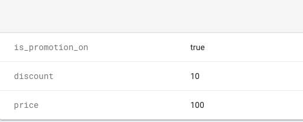
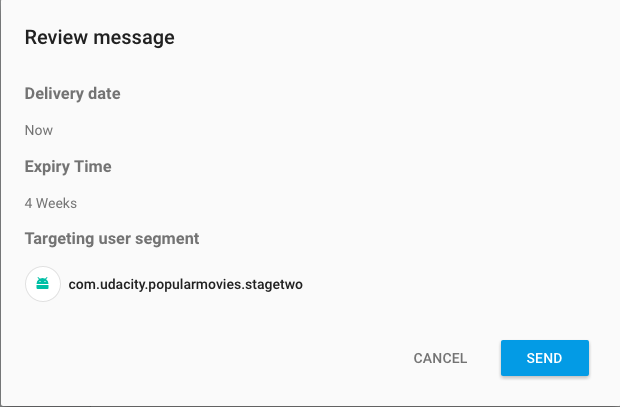
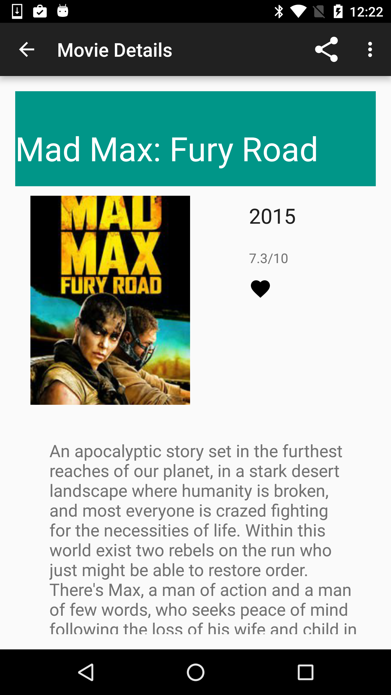
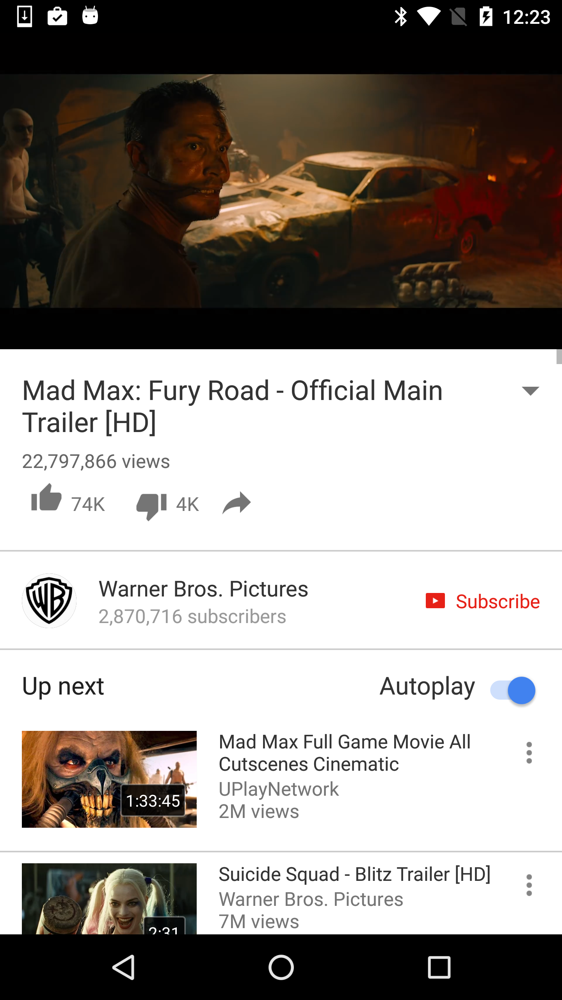
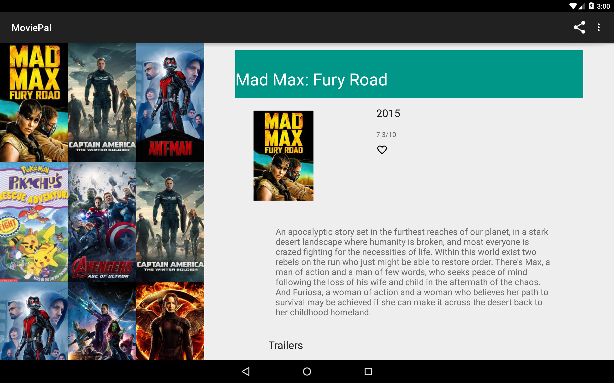

# Popular Movies App, Stage 2

Stage 2 of Popular Movies app required to complete Udacity Android Developer Nanodegree. 

### User Experience
In addition to Stage 1, the Stage 2 project adds the following UI enhancements:

1. Movie Details layout contains a section for displaying trailer videos and user reviews (screenshot 1)
2. In the movies detail screen, a user can tap a button(for example, a star) to mark it as a Favorite (screenshot 2)
3. When a trailer is selected, app uses an Intent to launch the trailer (screenshot 3)
4. Tablet UI uses a Master-Detail layout implemented using fragments. The left fragment is for discovering movies. The right fragment displays the movie details view for the currently selected movie (screenshot 4)

## Firebase
### Firebase Analytics
Firebase Analytics provides insight on app usage and how users are engaging with your app.



### Firebase Crash Reporting
Crash Reporting is a nifty server-side tool that creates detailed reports of errors in your app. We'll use Firebase Crash Reportng to post custom log event whenever someone saves a movie as a Favorite.


### Firebase Remote Config
Firebase remote config can be used for A/B testing. We'll use Remote Config to pull condition if we want to offer discount to users, if yes, we will also fetch the discount and show final price in Movie Details screen.



### Firebase Cloud Messaging
The app can receive push notifications from Firebase back-end. If the app is in background, the user sees an Android notification. However, if the app is currently running, the onMessageReceived() callback shall be triggered. See screenshots below.
Note: FCM has a dependency on Google Play Services. In the MainActivity, we check for GPS support.



### Screenshots






### Change API Key

In order to run the app, you must create your own Movie DB API key. See [here](https://www.themoviedb.org/documentation/api?language=en) for more info. Once you have crated an API key, insert the same in stagetwo.util.Constants.java file.
 


```
 public static final String MOVIE_DB_API_KEY = "YOUR_API_KEY";

```

### Libraries

This project demonstartes the use of following libraries:

1. [Retrofit](http://square.github.io/retrofit/)- HTTP client library used for making network calls
2. [Butterknife](http://jakewharton.github.io/butterknife/)- used for view injection
3. [Otto](http://square.github.io/otto/)- an event bus
4. [Picasso](http://square.github.io/picasso/)- an image loading and caching library
5. [Recycler View] (http://developer.android.com/training/material/lists-cards.html)- an advanced and flexible version of ListView
6. [Recycler View Joiner] (https://github.com/j2esu/rv-joiner)- a library to join multiple Recycler Views
7. [Stetho] (http://facebook.github.io/stetho/)- a debug bridge for Android applications
8. [Firebase Cloud Messaging] (https://firebase.google.com/docs/cloud-messaging/)- a cross-platform client notification platform

### Support

If you've found an error in this project, please file an issue:

https://github.com/kunal-jaggi/PopularMoviesStage2/issues
